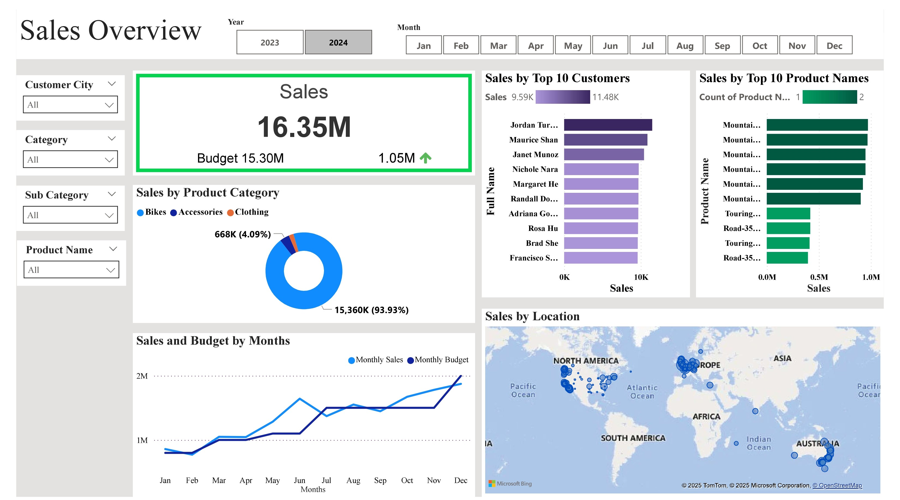
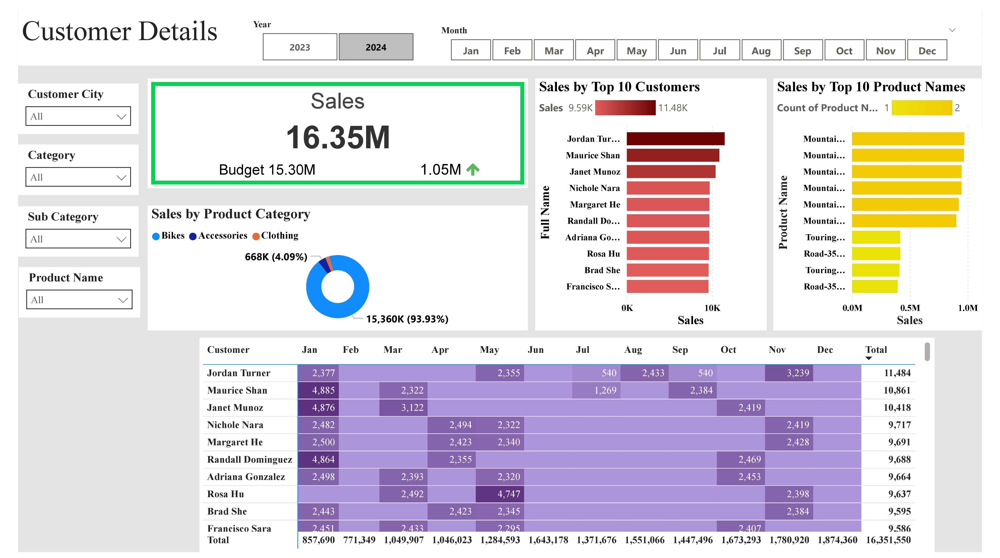
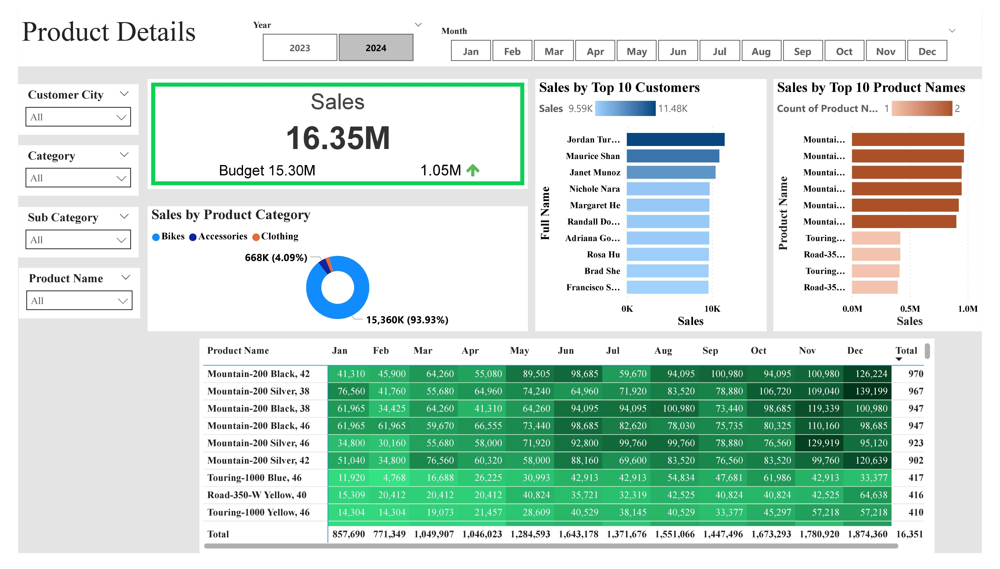

# AdventureWorks Internet Sales Analysis 2023-2024

##  Project Overview

This project addresses the demand for **modernized, interactive sales reporting** for AdventureWorks' Internet Sales division. Replacing static Excel sheets, we have built dynamic Power BI dashboards 
powered by SQL queries to track performance against budgets, identify top products/customers, and uncover actionable business insights.

The goal is to empower **Sales Managers and Sales Representatives** to:
- Understand sales trends over time
- Follow up on key clients and top-performing products
- Benchmark actual sales against budgets

**Tools Used**:  
- **Power BI** for visual analytics  
- **SQL (Microsoft SQL Server)** for data querying  

**Data Source**:
-**AdventureWorksDW2019** repository

-**Link:** <a href="https://github.com/Microsoft/sql-server-samples/releases/download/adventureworks/AdventureWorksDW2019.bak">AdventureWorks19 Download Link</a>

---

## About the Dataset – AdventureWorksDW2019

The AdventureWorksDW2019 database is a **sample enterprise-level data warehouse** provided by Microsoft. It mimics a real-world global manufacturing company’s operations, including **product sales, customer behavior, and budget data.**

For this project, we focused on:

- `Fact_Internet_Sales`: contains actual sales transactions over time

- `Dim_Product`: product-level details (category, subcategory, color, size)

- `Dim_Customer`: customer demographics and geography

- `Dim_Calendar`: time dimension used for sales and budgeting analysis

Further, the company's Budget for the years 2023-2024 is provided in the excel file `Fact_Budget_1`.

All required datasets are available in the `/Cleaned_Datasets` folder of this repository.

This dataset is ideal for building **data modeling, SQL querying, and Power BI dashboarding skills** that reflect actual business intelligence use cases.

___

##  Business Problem

AdventureWorks’ sales team previously relied on static reports, limiting their ability to take timely decisions. There was:
- **No easy comparison** of sales vs. budget
- **No quick visibility** of top-performing customers or products
- **No flexible filter mechanisms** for individual sales agents

**The Challenge**:  
To create **3 interactive dashboards** that would meet the needs of both the **Sales Manager** and **Sales Representatives**, using historical internet sales data from 2023–2024.

___

##  What This Project Solves

- Provides an at-a-glance **Sales Overview vs. Budget**
- Gives **customer-level** and **product-level** analysis with dynamic filters
- Helps sales agents **track monthly performance** and discover sales opportunities
- Enables **location-based insights** via Power BI maps

___

##  Dashboard 1: **Sales Overview Dashboard**

- Total Sales: **$16.35M** vs Budget: **$15.30M**  in 2024
- Overall performance exceeds budget by **$1.05M** in 2024
- **93.93% of revenue** comes from Bikes, revealing the core product
- Sales trend steadily **rises across the year 2024 but drops for 2023**, with December as the highest sales month in 2024
- Major customers are based in **North America and Europe**

###  Use Case:
For **Sales Managers** to get a consolidated real-time overview of all internet sales.

___

##  Dashboard 2: **Customer Details Dashboard**

###  Key Insights:

- Top customers include **Jordan Turner, Maurice Shan**, and **Janet Munoz**
- Monthly breakdown helps identify **purchase patterns** and **low-engagement months**
- Enables segmentation of customers by **city, category, and products**
- Used heatmaps to show **customer-wise sales intensity** month-by-month

###  Use Case:
For **Sales Representatives** to target **high-value clients** and strategize follow-ups.

___

##  Dashboard 3: **Product Details Dashboard**

###  Key Insights:

- Products like **Mountain-200 Black** and **Silver** dominate sales
- **Seasonality** observed in purchases—peak around mid and end-year in 2024
- Helps identify top-performing SKUs (Stock Keeping Units) for future inventory and promotion planning
- Highlights demand by **size, color**, and **product variant**

###  Use Case:
For **Sales Representatives** to focus on **best-selling items** and plan stock.

___

## Exploring the Repository

- **Clone the repo** to your machine:
 `git clone https://github.com/your-username/AdventureWorks-Sales-Dashboard.git`
- **Open Power BI (.pbix) file:**
  Navigate to `/PowerBI Reports/` and open `AdventureWorks_Sales_2023_2024.pbix`.
- **Review SQL Scripts:**
  Use SQL Server to run scripts from `/SQL Queries/`.
- **Use the Budget Excel File:**
  Use the 2023 & 2024 budget Excel provided by stakeholders.

___

## Stakeholders & Value Delivered

| Role          | Dashboard View             | Value Gained                                    |
| ------------- | -------------------------- | ----------------------------------------------- |
| Sales Manager | Sales Overview             | Budget monitoring, KPI tracking                 |
| Sales Rep     | Customer & Product Details | Sales targeting, high-performing SKUs & clients |

___

## Future Improvements

- Automate data refresh with Power BI Gateway
- Add forecasting using DAX or Azure ML integration

___

## Conclusion

This project transforms basic reporting into a **data-driven decision tool**. It empowers the sales team to **optimize performance, improve follow-ups, and align operations with budget goals**. With real-time dashboards and powerful filtering, AdventureWorks now has a **strategic edge** in managing sales effectively.

___
